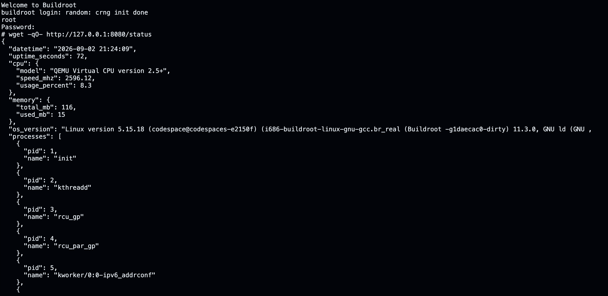

# Manual do Usuário

SystemInfo

Manual do Usuário - Trabalho Prático 1 (Laboratório de Sistemas Operacionais)

## 1. Requisitos

- O trabalho deve ser executado no Codespace do repositório labsisop-buildroot.

- A imagem Linux é gerada pelo Buildroot para a plataforma i386/i686 e executada no QEMU.

- O Python 3 precisa estar habilitado na imagem.

- Não há bibliotecas externas: o programa usa somente módulos da biblioteca padrão do Python.

- Os arquivos do trabalho estão na branch trabalho-pratico-1.

## 2. Como executar

1. Abra um terminal pelo menu Terminal > New Terminal.

2. Entre na pasta do projeto e confira a branch atual:

   ```sh
   cd /workspaces/labsisop-buildroot
   git branch --show-current
   ```

3. Se o resultado não for trabalho-pratico-1, execute:

   ```sh
   git switch trabalho-pratico-1
   ```

4. Gere a imagem do Buildroot:

   ```sh
   make -j2
   ```

5. Depois da compilação, inicie o QEMU:

   ```sh
   ./start-qemu.sh
   ```

6. Aguarde o boot. A mensagem Starting systeminfo: OK mostra que o servidor iniciou sozinho. Entre com usuário root e senha root.

7. Consulte o endpoint:

   ```sh
   wget -qO- http://127.0.0.1:8080/status
   ```

8. Para encerrar o sistema e voltar ao terminal do Codespace, execute:

   ```sh
   poweroff
   ```

## 3. Funcionamento

O Buildroot usa o diretório systeminfo-overlay para copiar o programa systeminfo.py para /usr/bin e o script S99systeminfo para /etc/init.d. Durante o boot, esse script inicia o servidor automaticamente em segundo plano.

O servidor escuta em 0.0.0.0:8080 e aceita somente GET /status. Quando esse endereço é acessado, as funções de coleta são executadas e o resultado é transformado em JSON. Qualquer outro caminho recebe a resposta HTTP 404 Not Found.

As informações são lidas novamente a cada requisição. Em cada função, as variáveis são definidas, os arquivos são lidos, os valores são processados e o resultado é retornado de forma direta. Por isso, campos como data, tempo desde o boot e uso da CPU podem mudar entre duas chamadas.

## 4. Informações exibidas no JSON

A resposta contém as informações pedidas no enunciado:

- `datetime` - data e hora atual, obtida com datetime.now() no formato YYYY-MM-DD HH:MM:SS.

- `uptime_seconds` - segundos desde o boot, lidos do primeiro valor de /proc/uptime.

- `cpu.model` - modelo do processador, lido de /proc/cpuinfo.

- `cpu.speed_mhz` - frequência da CPU; o programa lê cpu MHz de /proc/cpuinfo e depois tenta /sys/devices/system/cpu/cpu0/cpufreq/scaling_cur_freq. Quando esse arquivo existe, seu valor substitui o anterior.

- `cpu.usage_percent` - porcentagem de uso calculada pela diferença entre duas leituras de /proc/stat, separadas por 0,1 segundo.

- `memory.total_mb` - memória total, obtida de MemTotal em /proc/meminfo e convertida para megabytes.

- `memory.used_mb` - memória usada, calculada por MemTotal menos MemAvailable.

- `os_version` - versão do sistema e do kernel, lida de /proc/version.

- `processes` - lista com pid e name; os PIDs vêm dos diretórios numéricos de /proc e os nomes de `/proc/<pid>/comm`.

- `disks` - lista com device e size_mb; os dispositivos vêm de /sys/block e o tamanho do arquivo size é convertido de setores de 512 bytes para megabytes.

- `usb_devices` - lista com port e description; os dados vêm de /sys/bus/usb/devices, usando manufacturer e product.

- `network_adapters` - lista com interface e ip_address; as interfaces vêm de /sys/class/net e os endereços IPv4 são identificados em /proc/net/fib_trie com auxílio de /proc/net/route.

Se algum recurso opcional não existir, a chave continua na resposta com zero, texto vazio, Unknown ou uma lista vazia. Assim, o formato do JSON não muda.

## 5. Saída do programa

A chamada abaixo mostra o JSON retornado pelo sistema executado no QEMU:



Figura 1. Resposta do endpoint /status.

Na captura, o servidor retornou dados da CPU, 116 MB de memória total, o disco /dev/sda e as interfaces de rede. A lista usb_devices ficou vazia porque o QEMU não apresentou um dispositivo USB, o que é um resultado válido.

Os números da captura são apenas um exemplo real de execução. Data, uptime, uso da CPU, memória e processos variam conforme o momento da consulta.

## 6. Arquivos entregues

- `.config` - configuração do Buildroot na raiz do projeto.

- `systeminfo-overlay/usr/bin/systeminfo.py` - código completo do servidor.

- `systeminfo-overlay/etc/init.d/S99systeminfo` - script de inicialização automática.

- `README.md` - manual básico do programa.

- `docs/status-response.png` - captura da resposta do endpoint.
